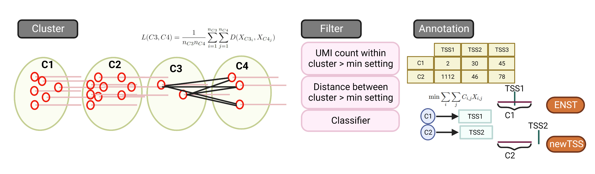
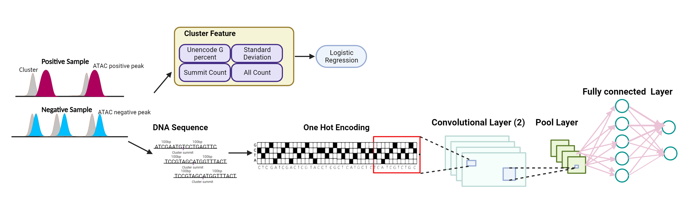

|PyPI| |Docs| 

.. |PyPI| image:: https://badge.fury.io/py/CamoTSS.svg
       :target: https://pypi.org/project/CamoTSS/
.. |Docs| image:: https://readthedocs.org/projects/camotss/badge/?version=latest
      :target: https://camotss.readthedocs.io/en/latest/?badge=latest

====
Home
====

About CamoTSS
==================

CamoTSS can  precisely identify TSS and quantify its expression by leveraging the cDNA on read 1, which enables effective detection of alternative TSS usage.

CamoTSS supports the analysis of alternative TSS at two levels, TSS cluster (**TC mode**) and CTSS (**CTSS mode**). 
The input files of CamoTSS include alignment file (`bam file`), annotation file (`gtf file`), cell list file and reference genome file (`fasta file`). 
The output files of CamoTSS include cell by all TSSs matrix (`h5ad`), cell by two TSSs matrix (`h5ad`), cell by CTSS matrix (`h5ad`) and cell by CTSS matrix (`h5ad`). 

CamoTSS identify TSS through the following steps.

Specificlly, a convolutional neural network was applied to filter false positive peaks.

It includes 3 steps to identify alternative TSS or CTSS usage: preprocessing, running CamoTSS and running BRIE2.

Please refer to our tutorial for details.

* `Preprocess for one sample and multiple samples`_.

* `Run CamoTSS`_.

* `Run Brie2`_.

.. _Preprocess for one sample and multiple samples: preprocess.rst

.. _Run CamoTSS: run_CamoTSS.rst

.. _Run Brie2: runBRIE.ipynb

.. toctree::
   :caption: Main
   :maxdepth: 1
   :hidden:

   index
   install
   preprocess
   run_CamoTSS
   runBRIE
   release
